# 上午部分：

## L4T系统与x86系统的差别

X86 Ubuntu:是指运行在X86架构CPU的linux ubuntu版本的操作系统。
L4T Ubuntu: L4T 是linux for tegra的缩写，Tera是集成了ARM架构的CPUNVIDIA的GPU的处器芯片，所以L4T Ubuntu就是为运行在基arm架构的Tegra芯片上的linuxubuntu版本的操作系统，它是专门为Tegra定制的Ubuntu特殊版本。

应用场景:ARM处理器定位于嵌入式平台，应用在开发板、边缘设备智能设备上;X86定位于桌面PC和服务器。
ARM是为了低功耗高效率设计的，而X86是为了追求高性能
设计架构:ARM是精简指令集 (RISC)架构;x86是复杂指令集(CISc)架构。
ARM几乎都采用Linux的操作系统:X86多为window系统也可采用linux操作系统。

## Ubuntu目录结构

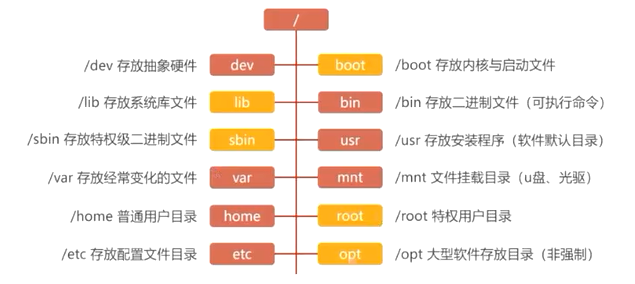

## Ubuntu用户权限

进入超级用户 `su` 或者 `su -` 

退出当前用户 `exit` 

临时获取超级用户权限 `sudo + 命令`

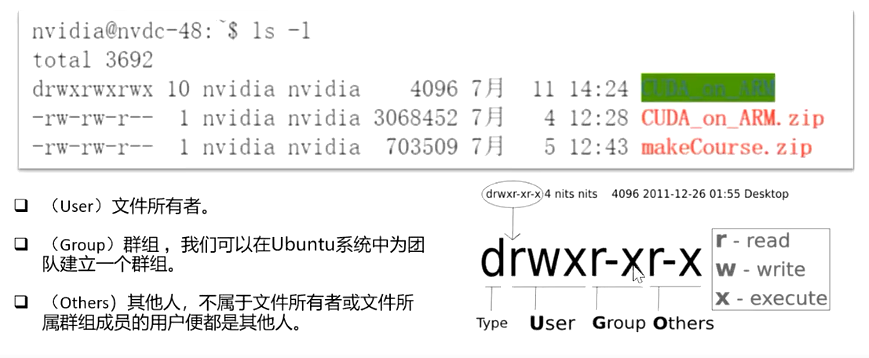

**权限修改** 

字母法：`chmod (u g o a)(+ - =)(r w x) (文件名)`

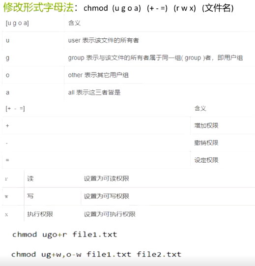

数字法：`chmod + 数字组合 + 文件名`

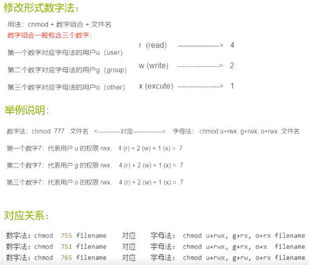


## Ubuntu常用命令

查看当前文件夹内容 `ls [-option] [dir,file]`

切换到指定目录 `cd [dir]`

打印当前工作目录 `pwd [-option]`

查看文内容、创建合并文件、追加文件内内容 `cat [-option] [file]`

查看分页内容 `more [-option] file`

清除当前命令行内容 `clear`


不存在文件就创建文件，否则修改文件最后编辑时间 `touch [-option] file`

创建目录， -p可以以层级形式创建目录 例如 `mkdir -p a/b/c`   `mkdir [-option] dir`

删除文件或者目录，删除后无法恢复 `rm [-option] file`

删除目录，目录必须为空 `rmdir [-option] dir`


复制文件或者目录 `cp [-option] source_file target_file`

移动或重命名 文件或目录 `mv [-option]  source_file/dir  target_file/dir`


 在目录中搜索文件 `find [path] [-option] [expression]`

 在文本中查找内容 `grep [-option] [pattern] [file]`

 查看磁盘状态 `df -h` `du -h`

查看进程 `ps [-option]` 

动态显示进程情况 `top [-option] `

终止进程 `kill [-option] pid`


jtop查看工具 `sudo -M pip install -U jetson-stats`

## Ubuntu网络管理与SSH

查看网卡配置信息 `ifconfig [-option]`

ping一下地址 `ping [-option] destination`


SSH是专为远程登录会话和其他网络服务提供安全性的协议，有效防止远程管理过程中的信息泄漏
传输数据加密，能够防止DNS和IP欺骗专输数据压缩，加快传输速度。
Linux中默认已安装SSH客户端，可直接在终端中使用SSH命令。

`ssh root@ip_address`

## Makefile的基本介绍和编写规则

**Makefile:**当一个工程中的源文件不计数，其按类型、功能、模块分别放在若干个目录中，makefle定义了一系列的规则，可以来指定哪些文件需要先编译，哪些文件需要后编译，哪些文件需要重新编译。makefile就像一个Shell脚本一样，可以实现“自动化编译”，一旦写好，只需要一个make命令，整个工程完全自动编译，极大的提高了软件开发的效率。

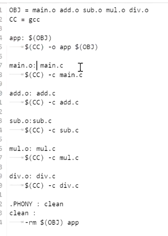

OBJ、CC等：提前设置的替换变量，在下文中使用 $(OBJ)的形式引用

app：$(OBJ) 表示app的生成依赖于什么文件

tab + $(CC) -o app $(OBJ):  gcc指定编译方法，app为生成文件名，$(OBJ)表示该步骤的编译依赖哪些文件。


# 下午部分：

## 异构计算

将一部分需要消耗大量资源的计算数据提前放到GPU显存中。

Host ：CPU和内存

Device： GPU和显存

## CUDA安装

Windows:

 https://docs.nvidia.com/cuda/cuda-installation-guide-microsoft-windows/index.html 只需安装一个.exe的可执行程序

linux:

 https://docs.nvidia.com/cuda/cuda-installation-guide-linux/index.html 按照上面的教程，需要6/7个步骤即可

## CUDA程序编写

把输入数据从CPU内存复制到GPU显存
在执行芯片上缓存数据，加载GPU程序并执行
将计算结果从GPU显存中复制到CPU内存中

**执行空间说明符**

`__global__`

global 执行空间说明符将函数声明为内核。它的功能是:在设备上执行，可从主机调用，可在计算能力为 3.2或更高的设备调用。

global函数必须具有 void 返回类型，并且不能是类的成员。

对global函数的任何调用都必须指定其执行配置

对global函数的调用是异步的这意味着它在设备完成执行之前返回

`__divice__`

在设备上执行，也只能在设备中调用；global中可以调用执行device的函数，但在一般的C语言程序中无法调用和执行

`__host__`

在主机上执行，也只能在主机中调用；相当于什么执行空间说明符都不加。

`__divice__`和`__host__`可以在一起使用，但是两者均无法和`__global__`一起使用


**在程序中使用CUDA**

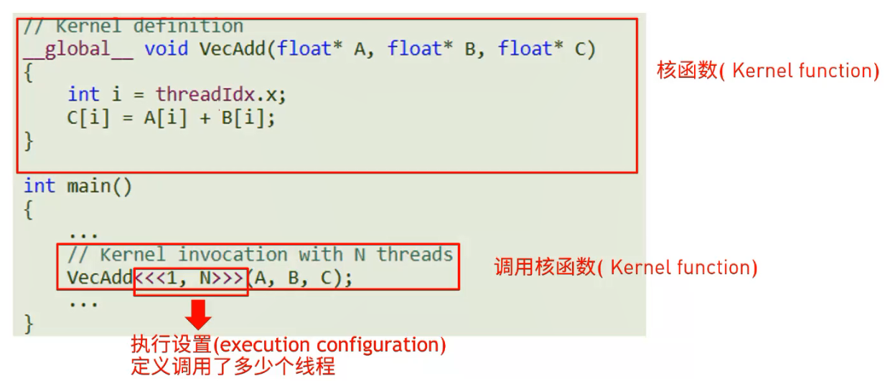

## CUDA程序编译

使用nvcc（类似gcc的作用）进行编译；https://docs.nvidia.com/cuda/cuda-compiler-driver-nvcc/index.html

将CPU代码部分和GPU代码部分分别编译，最后再合成一个可执行程序。

其中GPU编译时，有一个虚拟架构的东西，要保证现实架构的版本大于虚拟架构的版本。

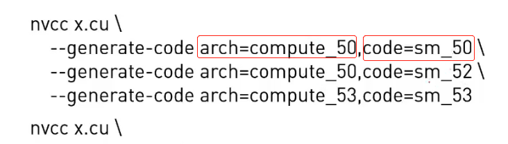

使用nvcc编译 .cu 或 .cuh文件生成 .o 或 .exe 文件

`nvcc --device-c hello_from_gpu.cu -o hello_from_gpu.o`

`nvcc hello_from_gpu.o hello_cuda_main.cu -o hello_from_gpu`

hello_cuda_main.cu 文件的执行需要依赖hello_from_gpu.cu文件，所以要先编译hello_from_gpu.cu文件，生成hello_from_gpu.o文件。


## 利用NVProf查看程序执行情况

Kernel Timeline 输出的是以gpu kernel 为单位的一段时间的运行时间线，我们可以通过它观察GPU在什么时候有闲置或者利用不够充分的行为，更准确地定位优化问题。nvprof是nvidia提供的用于生成gpu timeline的工具其为cuda toolkit的自带工具。

`nvprof -o out.nvvp a.exe`

可以结合nvvp或者nsight进行可视化分析
https://docs.nvidia.com/cuda/profiler-users-guide/index.html#nvprof-overview


`nvprof--print-gpu-trace a.exe`

查看核函数更加详细的资源使用信息，例如memory，带宽、GPU核等。

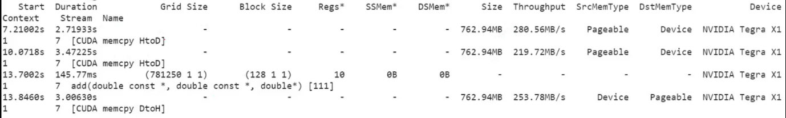

`nvprof--print-api-trace a.exe`

输出从头到尾所有的函数的资源使用信息，包括CUDA自动调用的函数。

## CUDA线程层次

Thread：sequential execution unit 所有线程执行相同的核函数

Tread Block：a group of threads 执行在一个Streaming Multiprocessor（SM），同一个Block中的线程可以协作。

Thread Grid：a collection of thread blocks 一个Grid当中的Block可以在多个SM中执行。


`HelloFromGPU <<<?, ?>>>()` 第一个数子代表使用多少个block，第二个数字代表一个block中有多少个Thread。

`dim3 grid(3,2,1), block(5,3,1)`

- threadldx.[x y z]是执行当前kernel函数的线程在block中的索引值
- blockldx.[x y z]是指执行当前kernel函数的线程所在block，在grid中的索引值
- blockDim.[x y z]表示一个block中包含多少个线程
- gridDim.[x y z]表示一个grid中包含多少个block

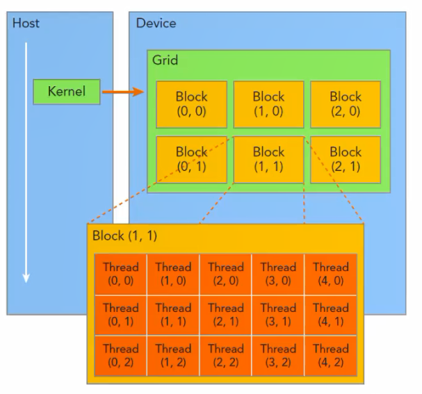


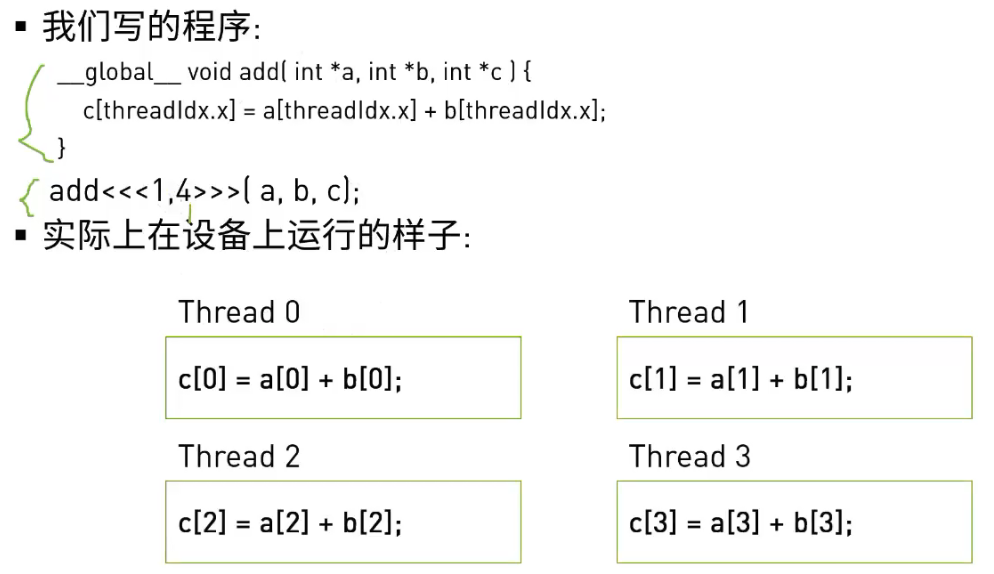

**CUDA的执行流程**

1. 加载核函数
   将Grid分配到一个Device
2. 根据<<<..>>>内的执行设置的第一个参数，Giga threads engine将block分配到SM中。一个Block内的线程一定会在同一个SM内，一个SM可以有很多个Block。
3. 根据<<<..>>>内的执行设置的第二个参数，Warp调度器会调用线程Warp调度器为了提高运行效率，会将每32个线程分为一组，称作一个warp。
4. 每个Warp会被分配到32个core上运行。**在申请thread的时候最好是32的倍数，避免出现线程浪费的情况。**

**确定线程执行的数据**

`int index = threadIdx.x + blockIdx.x * blockDim.x;`

**GPU 工作流程**

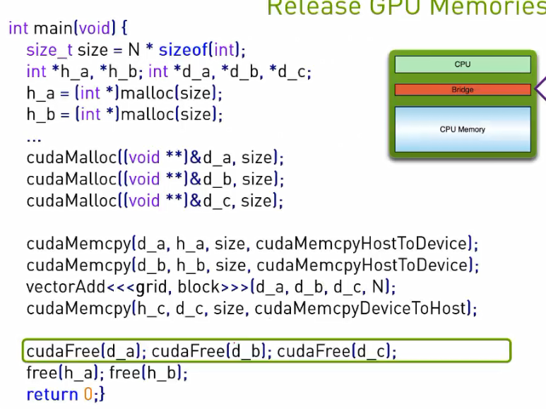

**block中最大申请的个数**

threadldx.[x y z] 中 `x*y*z`三个数字的乘积不能大于1024

**数据过大，线程不够用时**

可以采用在一个线程中嵌套循环的方式。

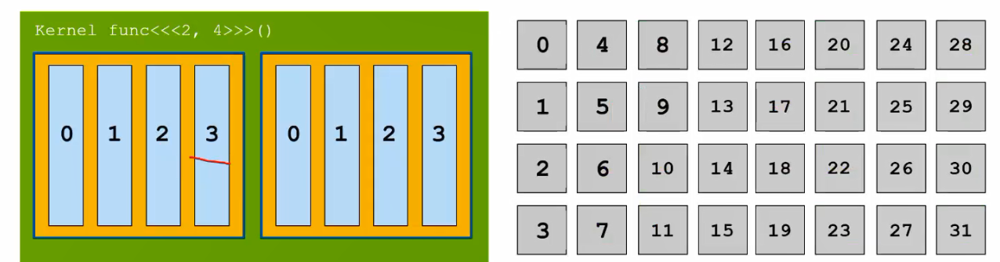

```c
void __global__ add(const double *x, const double *y, double *z, int n)
{
    const int n = blockDim.x * blockIdx.x + threadIdx.x;
    int stride = blockDim.x * gridDim.x;
    for(;index < n; index += stride)
    {
        z[n] = x[n] + y[n]
    }
}

```

# 作业：

```c
#include<stdio.h>

__global__ void hello_world_from_gpu()
{
    printf("A Hello World from GPU,Nice to meet you!!!\n");
}

int main(void){
    hello_word_from_gpu<<<1,1>>>();
    cudaDeviceSynchronize();
    return 0;
}
```

修改<<<...>>>中的值，查看执行结果，这里建议分三组: <<<33, 5>>>,<<<5, 33>>>,<<<5, 65>>>

```c
#include<stdio.h>

__global__ void hello_world_from_gpu()
{
    const int bid = blockIdx.x;
    const int tid = threadIdx.x;
    printf("A Hello World from GPU,Nice to meet you!!!\n", bid, tid);
}

int main(void){
    hello_word_from_gpu<<<1,1>>>();
    cudaDeviceSynchronize();
    return 0;
}
```

```c
#include <math.h>
#include <stdio.h>

void __global__ add(const double *x, const double *y, double *z, int count)
{
    const int n = blockDim.x * blockIdx.x + threadIdx.x;
    if(n < count)
    {
        z[n] = x[n] + y[n]
    }
}


```

